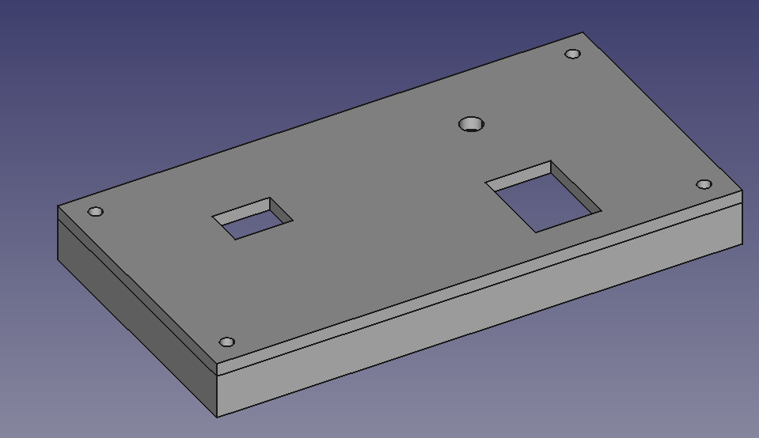
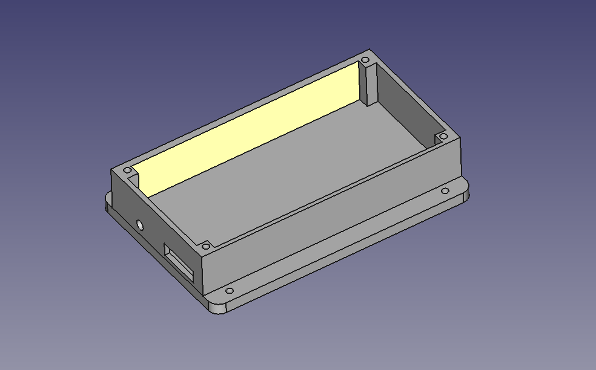
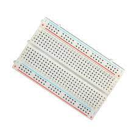
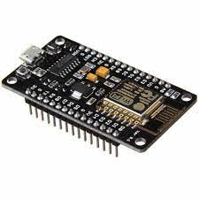
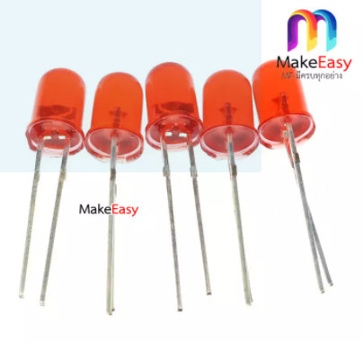
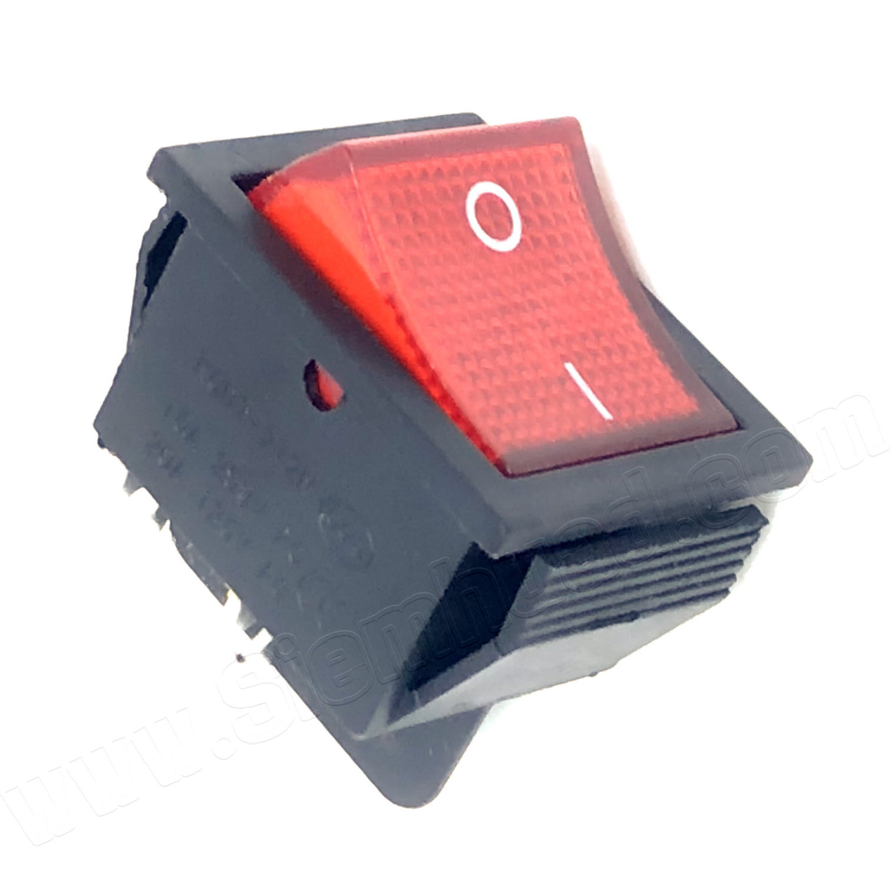

<h1>TempHumidBox</h1>

ส่วนฝา กว้าง63mm X ยาว120mm 

  

ส่วนกล่อง 80X120mm 

  
<h1>อุปกรณ์</h1>  

1.Breadboard 3.7mm

ที่มา

<a href=" ">https://www.lazada.co.th/products/js-910b-37-1-i899960679-s1817174327.html?exlaz=d_1:mm_150050845_51350205_2010350205::12:12654756915!117524295342!!!pla-294682000766!c!294682000766!1817174327!135253431&gclid=Cj0KCQjwssyJBhDXARIsAK98ITR1MCnF94tveQ1Qvz00456ZXcG89rLSUP0R-mrSYsodgyDPuh--RJ4aAidCEALw_wcB</a>
  

2.NodeMCU

ที่มา

<a href=" ">https://th.cytron.io/p-nodemcu-lua-v3-esp8266-wifi-with-ch340c</a>  
  

3.DHT22 15x17 mm 

ที่มา

<a href=" ">https://www.myarduino.net/article/64/%E0%B8%AA%E0%B8%AD%E0%B8%99%E0%B9%83%E0%B8%8A%E0%B9%89%E0%B8%87%E0%B8%B2%E0%B8%99-dht22-module-%E0%B9%82%E0%B8%A1%E0%B8%94%E0%B8%B9%E0%B8%A5%E0%B8%A7%E0%B8%B1%E0%B8%94%E0%B8%AD%E0%B8%B8%E0%B8%93%E0%B8%AB%E0%B8%A0%E0%B8%B9%E0%B8%A1%E0%B9%81%E0%B8%A5%E0%B8%B0%E0%B8%84%E0%B8%A7%E0%B8%B2%E0%B8%A1%E0%B8%8A%E0%B8%B7%E0%B9%89%E0%B8%99-%E0%B8%81%E0%B8%B1%E0%B8%9A-arduino</a>
  

4.LED 5mm 

ที่มา

<a href=" ">https://www.lazada.co.th/products/makeeasy-led-5mm-5-led-led-i2157454579-s7186560944.html?spm=a2o4m.searchlist.list.72.49e55d7bAi9KcA&search=1</a> 
  

5.ขั้วสายไฟ 3.7mm 

ที่มา

<a href=" ">https://www.lazada.co.th/products/makeeasy-led-5mm-5-led-led-i2157454579-s7186560944.html?spm=a2o4m.searchlist.list.72.49e55d7bAi9KcA&search=1</a> 
  

6.Switch 9x13mm 

ที่มา

<a href=" ">https://www.siemhuad.com/product/650/%E0%B8%AA%E0%B8%A7%E0%B8%B4%E0%B8%97%E0%B8%8A%E0%B9%8C%E0%B9%80%E0%B8%9B%E0%B8%B4%E0%B8%94%E0%B8%9B%E0%B8%B4%E0%B8%94%E0%B8%A1%E0%B8%B5%E0%B9%84%E0%B8%9F-%E0%B8%97%E0%B8%B1%E0%B9%89%E0%B8%A7%E0%B9%84%E0%B8%9B-power-on-off-switch-with-lamp-220vac</a> 
  

7.น็อต 1.5mm 

ที่มา

<a href=" ">http://www.dojogarden.com/index.php?id_product=84&controller=product</a> 
